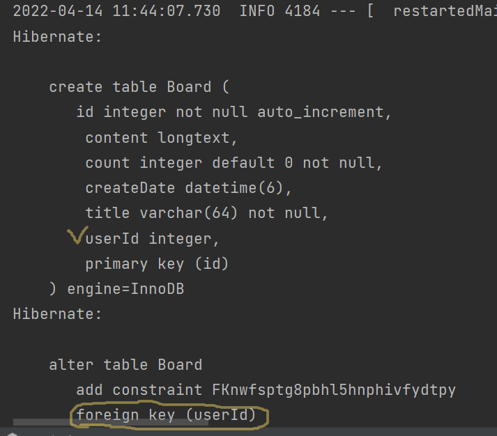
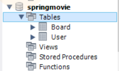
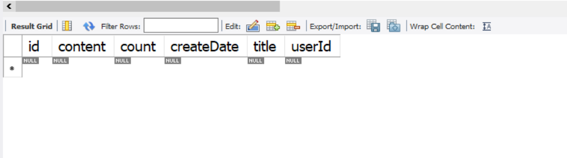
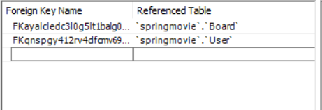

## 2. Board 엔티티 작성

> 아래와 같이 코드를 작성해준다. 
> 단, Board엔티티는 User엔티티와 연관관계가 설정이 된다. 그 내용은 아래에서 설명하겠다.

    @Entity
    public class Board {

    @Id
    @GeneratedValue(strategy = GenerationType.IDENTITY)
    private int id;

    @Column(nullable = false,length = 64)
    private String title;

    @Lob
    private String content;

    @ColumnDefault("0")
    private int count;

    @CreationTimestamp
    private Timestamp createDate;

    @ManyToOne
    @JoinColumn(name = "userId")
    private User user;
    
    }

### Board와 User의 연관관계 

    여기서 Board에 User의 연관관계가 맺어진 것을 확인할 수 있다.
    ManyToOne으로 되어있는데, 이것은 한명의 유저가 여러개의 Board객체를
    만들 수 있기 때문에 ManyToOne이다. 
    그렇다면 실제 형성된 테이블의 모습은 다음과 같다. *(DB에 들어갈때는 int값으로 들어간다.)
---
    SQL문이 작성되며 DB가 생성됐고,

    아래와 같이 DB역시 작성된 것을 확인할 수 있다.

---

> 이제는 연관관계에 대해서 알아보자 ,

    @ManyToOne
    @JoinColumn(name = "userId")
    private User user;

    @OneToMany(mappedBy = "board")
    private List<Reply> reply;

> Board 객체는 한명의 유저가 여러개의 보드 객체를 가질 수 있고 , 
> 한개의 Board 객체에는 여러개의 댓글이 달릴 수 있다. 

#### 하지만 여기서 중요한 부분이 있다.

    Reply가 mappedBy로 묶여있는데 이것은 FK를 설정하는 것이 아닌 
    DB조회를 했을때 값을 얻어오는 용도로 쓰이기 때문에 mappedBy로 묶인것이다.
    즉 DB에 컬럼으로 생성되지 않는다, (연관관계는 묶여 있지만)

> 실제로 조회 해보면 다음과 같이 Reply가 컬럼에 없는것을 확인할 수 있다.

3. Reply엔티티 생성 

    @NoArgsConstructor
    @AllArgsConstructor
    @Data
    @Entity
    public class Reply {

    @Id
    @GeneratedValue(strategy = GenerationType.IDENTITY)
    private int id;

    @Column(nullable = false,length = 100)
    private String content;

    @ManyToOne
    @JoinColumn(name = "boardId")
    private Board board;

    @ManyToOne
    @JoinColumn(name = "userId")
    private User user;

    @CreationTimestamp
    private Timestamp createDate;

    }

> Reply 역시도 연관관계를 맺고 있지만 FK를 가지고 있다. 즉 연관 관계의 
> 주인이 되는 것이다.
> 테이블을 확인해보면 Foreign key로 Board User를 갖고 있음을 알 수 있다.

