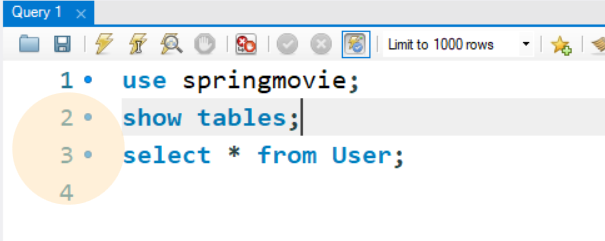

# 1. 엔티티 생성하기

### 이전에 만들었던 스프링 게시판을 Thymeleaf를 사용해서 다시 만들어봅니다.

    @NoArgsConstructor
    @AllArgsConstructor
    @Data
    @Entity
    public class User {

    @Id
    @GeneratedValue(strategy = GenerationType.IDENTITY)
    private int id;

    @Column(nullable = false, length = 64)
    private String username;

    @Column(nullable = false, length = 256)
    private String password;

    @Column(nullable = false, length = 64)
    private String email;

    @CreationTimestamp
    private Timestamp createTimestamp;

    @Enumerated(EnumType.STRING)
    private Role role;

    public User(String username, String password, String email) {
        this.username = username;
        this.password = password;
        this.email = email;
    }

    }

이와 같이 소스를 쓰고 실행을 한번 해본다.

위와 같은 명령어를 순서대로 입력해준다.

그러면 아무것도 없던 테이블에 성공적으로 User 테이블이 생성된 것을 볼 수 있다.

### 우선은 성공적으로 유저 테이블이 생성되었다. 

그리고 사이트가 작동하는지 알아보기 위해 컨트롤러로 값이 반환되는지 확인해본다.

    @RestController
    public class UserController {
    
        @GetMapping("/test")
        public String firstviewPage(){
            return "test 페이지입니다.";
        }
    }

이와같이 쓰면 페이지를 실행했을때 test페이지입니다 라는 응답이 떠야한다.

화면이 정상적으로 뜨는 것으로 확인하였다.

---

# 2.User엔티티에 대한 테스트 코드 작성하기

> 엔티티를 만들었으니 이에 대한 테스트를 진행하려고 한다.
> 우선 Repository 패키지를 만들어주고 안에 UserRepository인터페이스를 작성해준다.
> 그리고 테스트 코드를 작성한다.

    @DataJpaTest
    @AutoConfigureTestDatabase(replace = AutoConfigureTestDatabase.Replace.NONE)
    @Rollback(value = false)
    public class UserControllerTest {

    @Autowired
    private UserRepository userRepository;

    @Test
    @DisplayName("유저 객체의 생성에 대한 테스트이다.")
    public void firstTest(){

        User oneUser = new User("HongGildong","asdf1234","LaLaRand@naver.com");
        User oneUserSave = userRepository.save(oneUser);

        assertThat(oneUserSave.getId()).isGreaterThan(0);

    }

> 유저 객체는 3가지 값을 받는다. username,password,email 이렇게 3가지 값을 받고, 이에대한 값을 작성해주면 된다.
> 그리고 테스트를 돌려본다.

### 오류가 난다.

--- 

- 찾아보니 annotationProcessor 혹은 Junit과 관련된 오류인 것 같았다.
- 그래서 설정에 들어가서 아래와 같이 체크 박스를 켜준다. 그리고 다시 시도해봤다.

### 그래도 안된다.

    다른 방법을 찾아본다.
    
    annotationProcessor('org.projectlombok:lombok')
    testAnnotationProcessor('org.projectlombok:lombok')

    위에 내용을 디펜던시에 추가하라고 한다.

    그리고 다시 해본다.

### 이번엔 다른 오류가 발생한다.

오류의 내용은 다음과 같다

> Transaction silently rolled back because it has been marked as rollback-only
> not-null property references a null or transient value : com.memories.springboard.Entity.User.role;

    위의 내용을 해석해보자면 Null이 아닌 값이 Null로 참조되었다는 것이다.
    그렇다면 null값이 들어가면 안되는 내용을 찾아보자.

## 발견했다.

생성자를 만들면서 username,password,email 값을 받았지만 

role은 들어가지가 않은 것이다.
그렇다면 role값을 집어넣어서 해결하던지, 

아니면 Not-null을 해제해주는 방식으로 해결한다.

아래와 같이 추가해준다.그리고 다시 실행해본다.

#### SQL문이 작성되며 성공적으로 값이 들어갔고 테스트가 통과했다.

그렇다면 이제 다시 MySQL에 들어가서 값이 들어가있는지 확인해본다.     
role값에 default를 줬으니(String으로) 만들어지는 모든 생성자는 default를 갖게 될 것이다.   
테스트해보자

### 아까 테스트한 값이 정상적으로 입력되었음을 알 수 있다.

    이렇게 해서 User엔티티와 UserRepository에 대한 테스트가 성공적으로 통과 되었다.

## 1-1 UserEntity의 테스트 추가 

    @Test
    @DisplayName("다수의 유저 객체를 생성하기 위한 테스트이다.")
    public void secondTest(){
        User secondUser = new User("Kim","test1234","love1234@naver.com");
        User thirdUser= new User("ChooChoo","test2468","lovely1234@gmail.com");
        User forthUser = new User("UbiSoft","soso1414","UbiCare@naver.com");
        List<User> list = new ArrayList<User>();
        list.add(secondUser);
        list.add(thirdUser);
        list.add(forthUser);
        for(User showList: list) {
            System.out.println(showList.toString());
        }
    }

---
    아래와 같은 메시지가 출력되며 정상적으로 작동하는 것을 알 수 있다.
    그리고 저장은 userRepository로 넣어주면 된다.

저장되어 있는 값을 확인해봤고 값이 들어간 것을 확인할 수 있었다.

---
### > 이번에는 생성되어 있는 값을 얻어오는 것을 테스트하겠다.
    
    @Test
    @DisplayName("유저 객체를 얻어오는 것을 테스트한다.")
    public void thirdTest(){
         User user = userRepository.findById(1).get();
         System.out.println(user);
    }

아래와 같이 나온다. 

> 성공적으로 값을 얻어온 것을 알 수 있다. 해당 Id에 값들을(1번 유저) 얻어왔다,
> 그러면 여기서 값들을 수정하는 작업을 해보겠다. 코드를 아래와 같이 쓰고 테스트를 실행해본다.
        
        @Test
        @DisplayName("유저 객체를 얻어오고 가지고 온 것을 수정하며 테스트한다.")
        public void thirdTest(){
        User user = userRepository.findById(1).get();
        user.setUsername("dlwhddksiq");
        user.setEmail("dlwhddksiq@naver.com");
        System.out.println(user.toString());

    성공적으로 값이 바뀌었다. 원래 1번 아이디의 값은 username이 HongGildong이었으나 
    dlwhddksiq로 바뀌었고 , 이메일 역시도 바뀌었다. 이렇게 값을 수정하는 부분도 테스트완료 했다.
    
# -> [Board객체의 생성으로 넘어가기](https://github.com/LeeJongAnn/for_Study/blob/master/history/1/1-1/README2.md)

