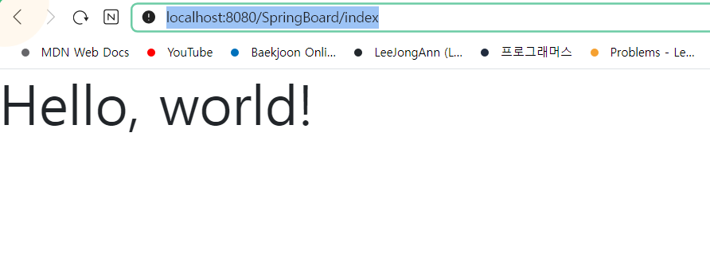
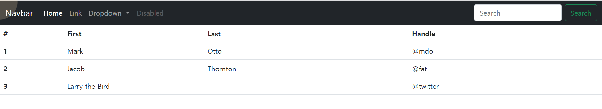

# 2. 부트스트랩으로 화면 만들기

### 이전에 만들었던 스프링 게시판을 Thymeleaf를 사용해서 다시 만들어봅니다.

---

- 이번 프로젝트에는 타임리프를 사용하려고 한다. 타임리프는 스프링부트가 공식 지원하는 서버사이드 엔진이다.
- 저번 프로젝트에는 JSTL을 사용해서 JSP로 게시판을 작성했지만 이번에는 타임리프를 이용해서 프로젝트를 해보려고 한다.

---

    @Controller
    public class UserController {
    @GetMapping("/index")
    public String firstviewPage(){
        return "index";
    }
---
    application.properties에 컨텍스트 패스를 줬다. SpringBoard로 줬으므로 
    /SpringBoard/index를 주면 index.html로 이동한다

정상적으로 작동하는 것을 확인할 수 있다.

---

> 이제는 화면을 만들려고 한다. 화면은 부트스트랩을 활용해서 작성해준다. 
> 부트스트랩에 들어가서 네비게이션 바와 테이블을 가져와 index 파일에 붙여넣어준다.

그러면 아래와 같은 화면을 만들 수 있다.

