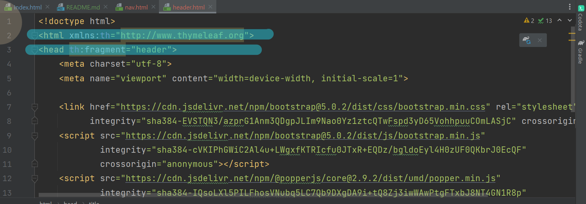
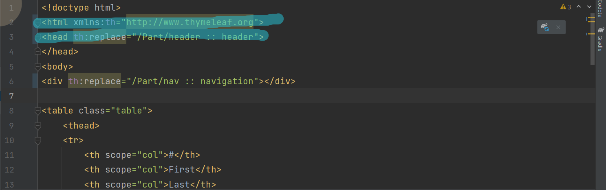
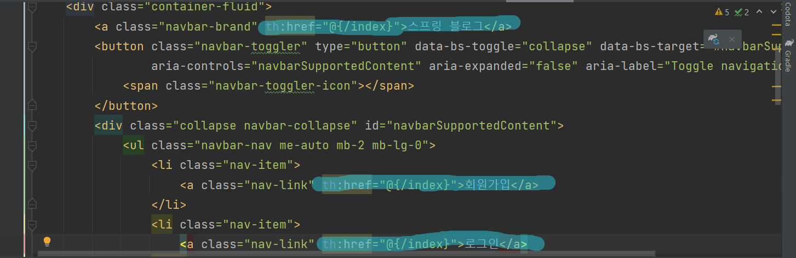
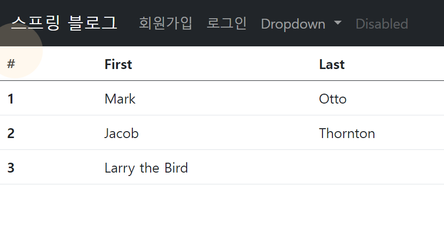

#3. Thymeleaf로 화면 분할하기 및 로그인 ,회원가입 화면 만들기

    JSP로 게시판을 만들때 화면분할을 했었다.
    Thymeleaf 역시도 동일한 기능을 가지고 있어서 
    이번에는 타임리프로 화면분할을 해보려고 한다.

> 우선은 알아야할 것이 있다.
>
> 첫번째로는 head에 xmlns 네임스페이스를 thymeleaf로 작성해줘야 한다.
> 

    형광펜으로 칠해준 부분을 보면 xmlns에 타임리프 주소가 들어가있고
    밑에 보면 th:fragment 라고 적혀있다.
    이것은 이 부분을 떼어낼 부분이라고 표시하는 것이다.
    그러면 해당 부분이 <head>~</head>까지 떼어낼 수 있게 된다.
    쉽게 말해서 부품이라고 보면 될 것 같다.

> 떼어낸 부분을 바꿔치기할 html로 가서 아래와 같이 바꿔준다.
> 

    그러면 떼어낸 부분이 바꿔치기한 부분에 들어가면서 코드가 깔끔해진다.
    밑에 네비게이션 부분도 같은 원리로 바꿨다.
    주소도 조금 수정해준다.(네비게이션도 fragment선언 후 떼어냈다.)
    그러면 아래와 같은 모습이 된다.

### 그러면 이제 실행해서 확인을 해보자

    잘 바뀐 것을 확인할 수 있다.

