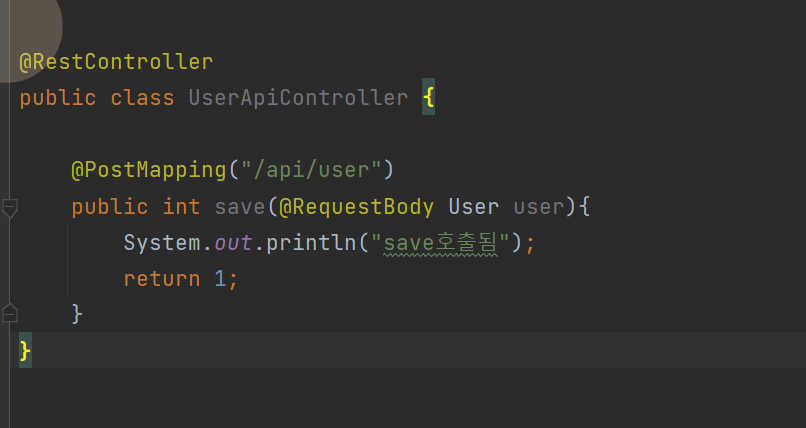
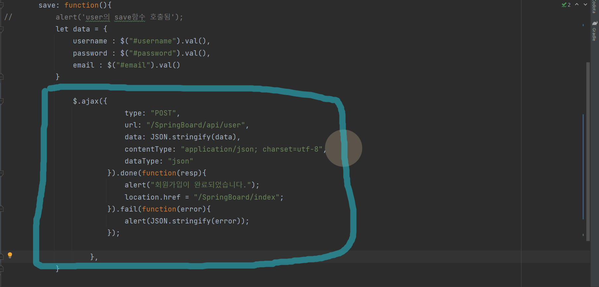
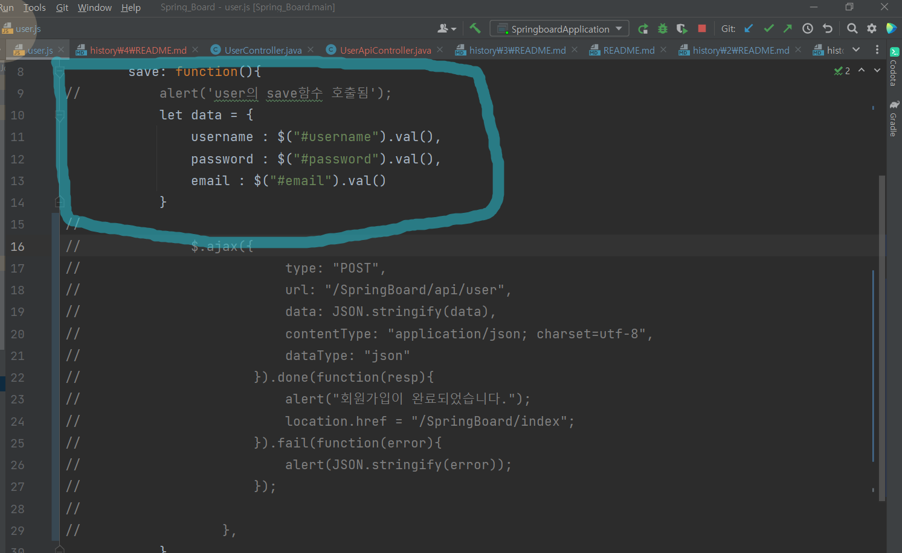
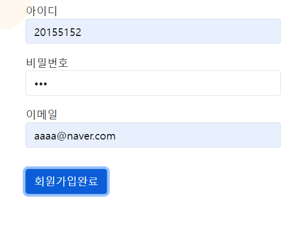
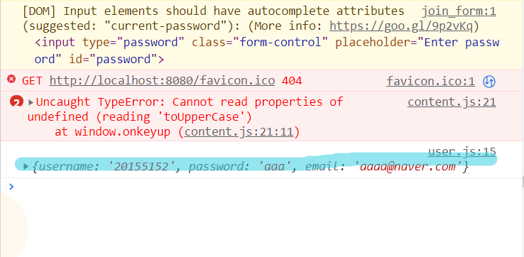
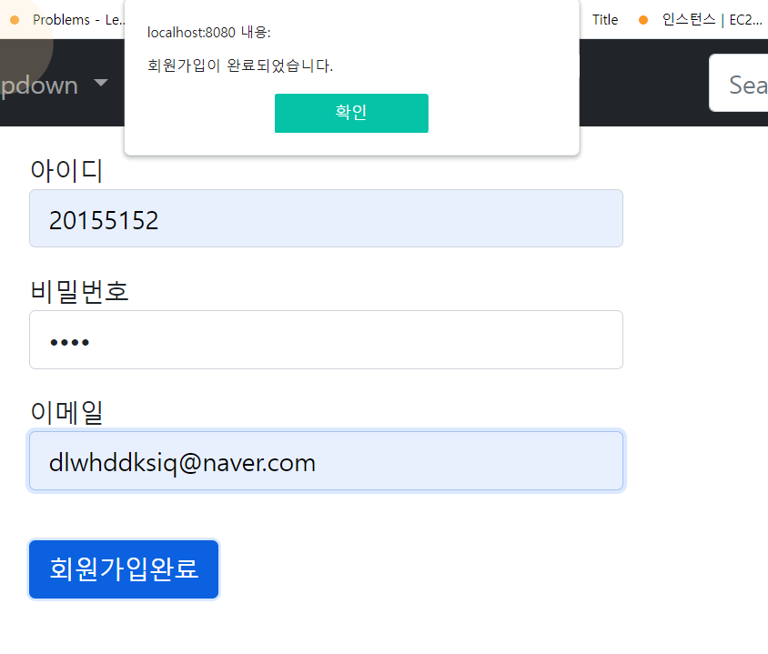

# 4. 회원가입 기능 만들기 
    우선은 Controller에서 ApiController를 만들어준다.
    그리고 코드를 아래와 같이 작성한다. 이 코드는 
    save함수가 호출 됐을때 정상적으로 작동하는지 응답을 주기위한 코드이다.

    
    그리고 아래와 같이 js 파일에 가서 코드를 작성해준다

    해당 코드는 회원가입 버튼을 클릭했을때 Post요청을 보내는 코드이다.
    우선은 주석처리하고 값이 정상적으로 올라오는지 확인해보겠다.

    주석 처리를 하고 값을 입력한 뒤 회원가입 버튼을 눌러본다.

    값은 이렇게 입력했다. 그렇다면 콘솔에서 값이 올라오는지 보면

    이렇게 값이 올라오는 것을 볼 수 있다.
    그렇다면 이제 주석 처리를 해제하고 다시 값을 입력해보면 다음과 같이 뜬다.

    즉 정상적으로 작동하는 것을 알 수 있다.
    

