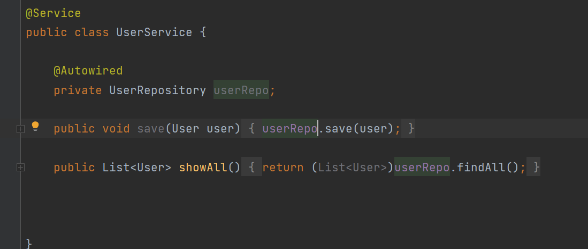
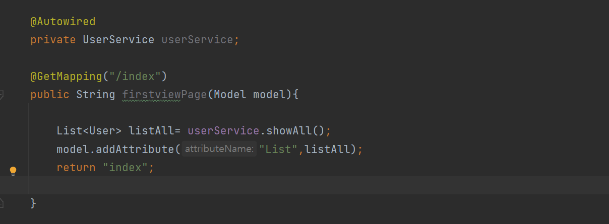
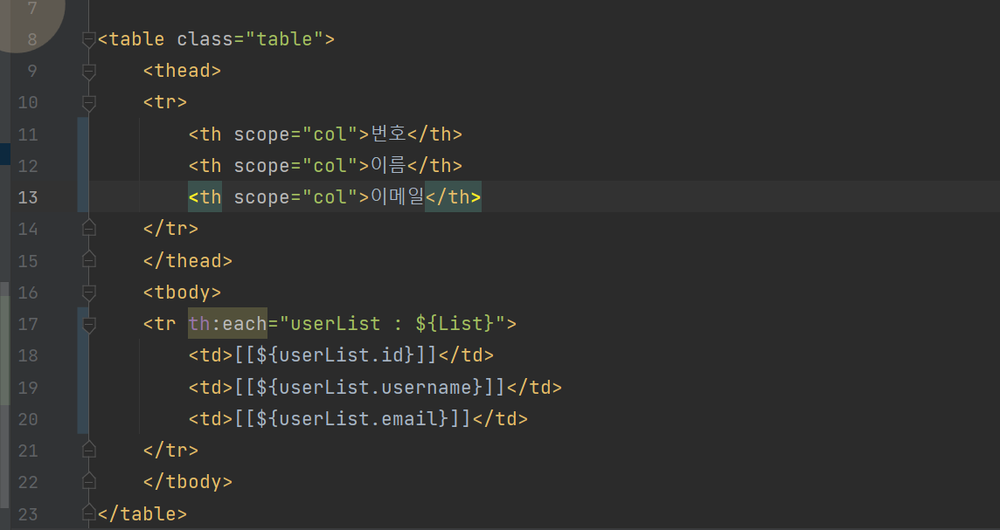
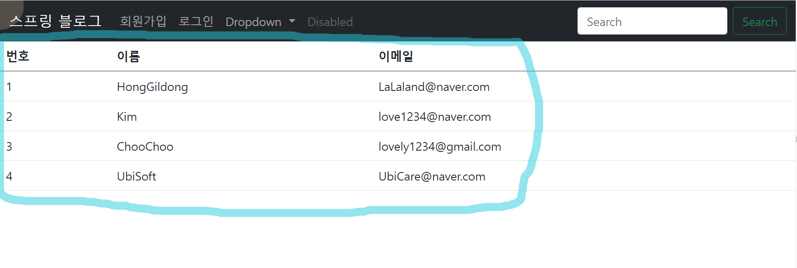

# 5. 유저 정보 관리 페이지 작성하기

    이제는 회원가입한 유저들의 정보를 관리하는 페이지를 
    만들어보려고 한다. 
 
    UserService 패키지를 만들어서 안에 클래스를 만들었다.
    그리고 UserRepository를 사용하여 안에 있는 findAll 메소드를 
    이용해서 유저 정보를 탐색하도록 만들었다.

    그리고 아래와 같이 코드를 작성한다.

    위의 코드는 model 값을 index페이지로 넘겨준다는 뜻이다.    
    그러면 index페이지는 UserController에서 넘겨준 값을 품고 있다.

> 그럼 index.html로 가서 Thymeleaf를 사용해서 값을 나타내보겠다.
> 아래와 같이 코드를 작성하고 실행해본다.

    그러면 일전에 작성했던 테스트 코드와 같이 DB에 있는 
    내용이 페이지에 뜨는 것을 확인할 수 있다.

    
