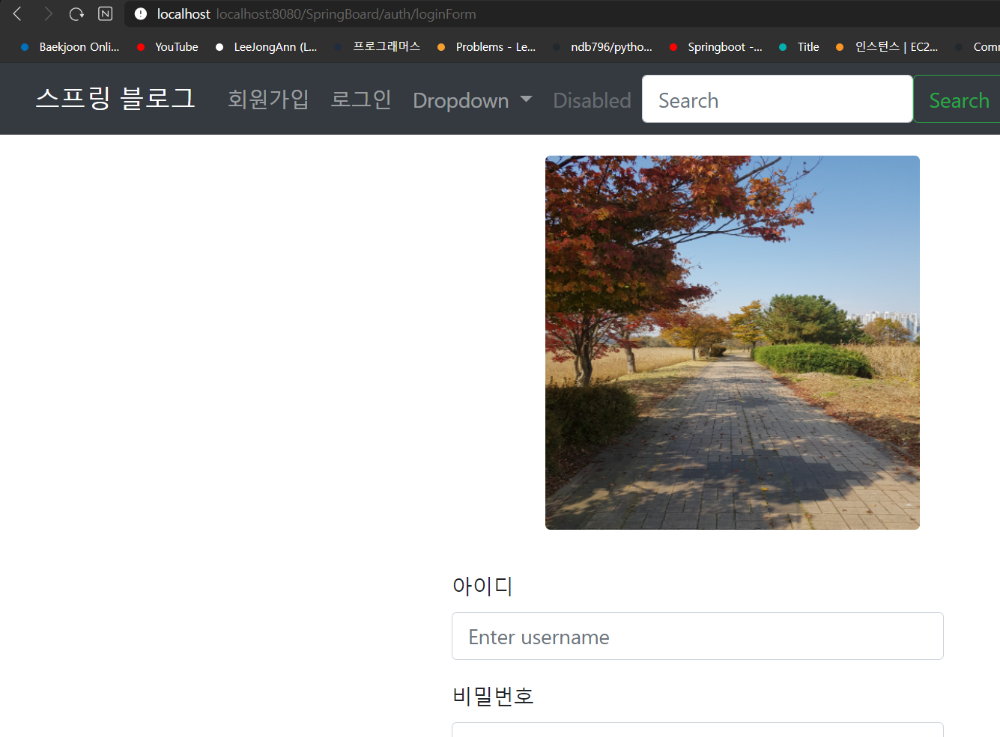

# ★★ 6.스프링 시큐리티 적용하기 - 회원가입하기

> 스프링 시큐리티를 적용해보려고 한다. 
> 우선은 dependency에 스프링 시큐리티를 추가해준다.

    implementation 'org.springframework.boot:spring-boot-starter-security'

> 그런 다음 접속을 하게되면 닫혀있는 모양으로 나온다. 
> user와 비밀번호가 나오고 입력해야 들어갈 수 있다.

    이렇게 Security Password 비밀번호가 뜨게 된다.
    그러면 이제 화면으로 가보겠다.

    

    이렇게 화면이 뜨게 되는데
    아이디에는 user를 넣고 
    비밀번호에는 아까 뜬 비밀번호를 넣어준다.

    그리고 로그인을 눌러주면 들어가게 된다.

    

    정상적으로 로그인이 된 것을 확인할 수 있다.
    하지만 이렇게 해서는 사용자가 회원가입한 아이디와
    비밀번호를 사용해서 로그인을 하는것이 아니다.
    그렇기 때문에 다른 설정을 통해서 로그인을 할 수 있도록 
    설정해줘야 한다.

### 즉 로그인 커스터마이징을 해줘야한다.

    이제 로그인 커스터마이징을 하려고 한다.
    Config 패키지를 생성하고 
    SecurityConfig 클래스를 만들어준다.
    그리고 아래와 같이 코드를 작성해준다.

    위의 코드는 다음 내용과 같다.
    어떤 요청이 들어왔을때 해당 주소로 되어있는 내용은 
    모두 허용하지만 , /auth가 붙어있지 않은 다른 요청들은 
    인증이 필요하다는 뜻이며 , 로그인 페이지는 
    .and() 밑으로 정한다는 뜻이다.
    
> 이제 접속을 해보겠다.
> 접속을 해보면 다음과 같이 모든 인증이 필요한 곳으로 
> 접속하게 되면 로그인 페이지로 이동하게 된다.

    회원가입과 로그인으로만 들어가질 수 있는 것을 확인할 수 있다.

#2. 스프링 시큐리티로 회원가입 하기

    스프링 시큐리티를 이제 적용을 했으니 , 
    회원가입을 다시 해보겠다. 그런데 중요한 것은 
    바로 회원가입이 적용되는 것이 아니다.
    
    스프링 시큐리티에서는 회원가입이 가능하려면 
    비밀번호가 암호화 되어있어야 한다.

> 그렇다면 비밀번호 암호화를 진행한다.
> 암호화는 Security를 추가하면 자동으로 생성되는
> BcryptPasswordEncoder를 이용한다.
> 

    BCryptPasswordEncoder를 
    Bean등록을 해주면 IoC컨테이너에서 관리해주므로 
    DI를 주입해서 쓰면 된다.
    
> 코드를 쓰고 회원가입에 비밀번호를 암호화
> 해주는 부분을 추가한다.

    
    이렇게 써주면 비밀번호를 얻어와서 
    암호화를 진행한 후 등록해준다.

    
    
    아이디와 비밀번호, 이메일을 입력해주고 회원가입을 하면 ?

    이렇게 성공적으로 값이 들어간 것을 알 수 있다.
    그리고 DB를 확인해보면 DB에도 암호화 된 값이 잘 들어가 있다. 

